# Referral & Reward Program

A full-stack **referral, investment-plan and reward platform** (an NGO-style "invest monthly, mature,
redeem for education / gadgets / donations" product). Members subscribe to plans, pay by simulated
AutoPay, earn interest at maturity, refer other members for commission, and redeem their balance in six
different ways. Admins configure plans, catalog, rules and approve money-moving requests.

This README is the single entry point for developers. If you are picking this project up for the first
time, read sections **1 → 7** in order (about 20 minutes), then keep section **11 (Developer guide)** open
while you work.

## Table of contents

1. [Overview](#1-overview)
2. [Tech stack](#2-tech-stack)
3. [Getting started](#3-getting-started)
4. [Architecture](#4-architecture)
5. [Project structure](#5-project-structure)
6. [Data model](#6-data-model)
7. [Functional flows](#7-functional-flows)
8. [Scenario handling reference](#8-scenario-handling-reference)
9. [Configurable business settings](#9-configurable-business-settings)
10. [Security model](#10-security-model)
11. [Developer guide](#11-developer-guide)
12. [Testing](#12-testing)
13. [PWA, push notifications and real-time updates](#13-pwa-push-notifications-and-real-time-updates)
14. [API documentation](#14-api-documentation)
15. [Simulated email and payments, and how to integrate real providers](#15-simulated-email-and-payments-and-how-to-integrate-real-providers)
16. [Prototype limitations and production roadmap](#16-prototype-limitations-and-production-roadmap)

---

## 1. Overview

### 1.1 What the product does

| Actor | Capabilities |
|---|---|
| **Visitor** (not logged in) | Browse the landing page, plan catalog, franchisee catalog, About Us and Contact Us; submit a general enquiry; register; log in |
| **User** (member) | Register (optionally with a referral code), log in with email + password + email OTP (2FA), subscribe to an investment plan with a simulated AutoPay mandate, see dashboard metrics, pay a failed instalment manually, share a referral code and track referral earnings, withdraw approved commission, redeem balance (course, refund, reinvestment, donation, franchisee, gadgets), receive in-app / email / push notifications, manage account (mobile number, password, push opt-out) |
| **Admin** | Operate the platform: users and referrers, plans and interest methods, catalog (universities, courses, gadgets, colleges, franchisee plans, donation recipients), commission approval, redemption approval and shortfall verification, the AutoPay simulator and batch jobs, general enquiries, notifications, emails outbox, ledger, audit log, reports/exports, site settings, About/Contact content, and login-screen theming |

Exactly two roles exist: `USER` and `ADMIN` (`Role` enum in `prisma/schema.prisma`). There are no
sub-roles.

### 1.2 Core business concepts (read this first)

These terms appear throughout the code and in comments (comments cite requirement numbers such as
"BRD Rule XXXVI" — the BRD is the business-requirements document the product was built against and is
maintained outside this repository; the comments are intentionally kept so the *reason* for a rule
stays next to the code that enforces it).

| Concept | Meaning |
|---|---|
| **Plan** | An admin-defined investment product: tenure in months, `MONTHLY` or `LUMPSUM` payment frequency, preset amounts, allowed payment cadences, an interest method, reward % and commission %. Status `ACTIVE` or `DISCONTINUED` |
| **UserPlan** | A user's enrolment in a plan. **Snapshots** the interest method/version, reward % and commission % at subscribe time so later admin edits never change an existing enrolment |
| **Interest method** | Simple, compound or custom-formula interest. Versioned: revising a method creates a new version; existing UserPlans keep the version they subscribed with |
| **Unified Ledger** | One `LedgerEntry` table holds *every* money movement (plan payments, interest, commissions, redemptions) with `balanceBefore` / `balanceAfter`. There is no separate commission ledger |
| **Locked principal** | Principal paid into plans that have not matured. Excluded from the redeemable balance |
| **Redeemable balance** | Latest ledger balance minus locked principal |
| **Reservation / Available Margin** | Pending redemption requests *reserve* part of the balance. `Available Margin = Redeemable balance − active reservations` |
| **Shortfall** | When a request exceeds Available Margin, the difference is paid offline; the request waits in `AWAITING_SHORTFALL_RESOLUTION` until an admin verifies it |
| **Reward Points** | Non-cash points earned on approved course redemptions; usable only for later course redemptions |
| **Referral / Commission** | One-level referral. The referrer earns commission on the referred user's successful payments (first payment = one-time; every Nth payment thereafter = recurring). Commission goes through an admin approval lifecycle |
| **Simulated provider** | Razorpay AutoPay and email are fake (rows in the database). Push notifications use real Firebase Cloud Messaging when configured |

### 1.3 Prototype status

This is a prototype built to a functional specification. Everything is wired end to end and covered by a
Playwright suite, but several production concerns are deliberately out of scope — see
[section 16](#16-prototype-limitations-and-production-roadmap). Read that section before taking the
project beyond local development.

---

## 2. Tech stack

| Layer | Technology |
|---|---|
| Framework | **Next.js 16** (App Router, React Server Components, Server Actions, Turbopack dev) |
| UI | React 19, Tailwind CSS 4, hand-written components in `src/components` (no UI library) |
| Language | TypeScript 5 (strict) |
| Database | **PostgreSQL** (a local instance), accessed through **Prisma 6** |
| Auth | Custom: bcrypt passwords, RS256 JWT access token (`jose`), rotating opaque refresh tokens, email-OTP 2FA |
| Validation | `zod` |
| Files/reports | `exceljs` (xlsx), `pdfkit` (pdf), CSV by hand; `sanitize-html` for admin-authored content |
| Push | Firebase Cloud Messaging (`firebase` web SDK + `firebase-admin`) |
| Tests | Playwright (browser end-to-end + a few DB-level integration specs) |
| Runtime target | Your local machine |

> **Next.js 16 note.** This project uses a recent Next.js whose conventions differ from older versions
> (for example the request interceptor is `src/proxy.ts`, not `middleware.ts`). When in doubt, read the
> guide for the feature you are touching under `node_modules/next/dist/docs/` before writing code.

---

## 3. Getting started

### 3.1 Prerequisites

- **Node.js >= 20.9** (developed on Node 24). Check with `node --version`.
- **PostgreSQL 14 or newer** running locally (see 3.2).
- A locally trusted HTTPS certificate if you want to use `npm run dev` (see 3.5), or just use
  `npm run dev:http`.
- Optional: a Firebase project if you want to test real push notifications (see
  [section 13](#13-pwa-push-notifications-and-real-time-updates)). Without it the app works normally and
  push delivery is silently skipped.

### 3.2 Create the local database

1. Install PostgreSQL (the official installer, Homebrew, your package manager — anything that gives you
   `psql` and a running server on `localhost:5432`).
2. Create an empty database for the app:

   ```bash
   psql -U postgres -c "CREATE DATABASE referral_rewards;"
   ```

3. Your connection string is then:

   ```
   postgresql://postgres:<your-password>@localhost:5432/referral_rewards
   ```

   If the password contains special characters such as `@`, percent-encode them (`@` → `%40`),
   otherwise the URL parser reads the wrong host.

`prisma/schema.prisma` reads **two** variables (`url = env("DATABASE_URL")` and
`directUrl = env("DIRECT_URL")`). With a plain local Postgres there is no connection pooler, so set
**both to the same connection string**.

> If every page suddenly returns 500, the first things to check are that the PostgreSQL service is
> running and that `DATABASE_URL` matches your local credentials and database name.

### 3.3 Environment variables

Create a file named `.env` in the project root (it is git-ignored — never commit it). Next.js also loads
`.env.local` with higher priority; if you have one, keep it consistent or remove it so it does not
silently override `.env`.

**Required**

| Variable | Purpose |
|---|---|
| `DATABASE_URL` | Postgres connection string used by the running app, e.g. `postgresql://postgres:<password>@localhost:5432/referral_rewards` |
| `DIRECT_URL` | Connection string used by Prisma migrations. For a local database use the **same value** as `DATABASE_URL` |
| `JWT_PRIVATE_KEY` / `JWT_PUBLIC_KEY` | RS256 key pair (PEM, `\n`-escaped on one line) used to sign/verify access tokens. Generate with `node scripts/generate-jwt-keys.mjs >> .env` |
| `RAZORPAY_WEBHOOK_SECRET` | Locally generated secret that signs/verifies the *simulated* Razorpay webhook payloads. Not a real Razorpay credential. `node -e "console.log(require('crypto').randomBytes(32).toString('hex'))"` |

**Optional**

| Variable | Default | Purpose |
|---|---|---|
| `JWT_ACCESS_TOKEN_TTL_MIN` | `30` | Access-token / session-cookie lifetime in minutes (ignored when "Remember me" is ticked) |
| `NEXT_PUBLIC_APP_URL` | `http://localhost:3000` | Base URL used to build absolute deep links (push notification links must be absolute) |
| `NEXT_PUBLIC_APP_NAME` | — | Display name fallback |
| `NEXT_PUBLIC_FIREBASE_API_KEY`, `..._AUTH_DOMAIN`, `..._PROJECT_ID`, `..._STORAGE_BUCKET`, `..._MESSAGING_SENDER_ID`, `..._APP_ID`, `..._VAPID_KEY` | — | Firebase web client config + Web Push VAPID key (browser side of FCM) |
| `FIREBASE_SERVICE_ACCOUNT_PATH` | — | Path to a Firebase Admin SDK service-account JSON on the server. Keep that file **outside version control** |
| `NEXT_PUBLIC_ENABLE_SW_IN_DEV` | `false` | Register the service worker in dev (needed to test FCM locally; off by default because cache-first behavior serves stale dev chunks) |
| `API_DOCS_USERNAME` / `API_DOCS_PASSWORD` | `api-docs` / `ChangeMe123!` | Basic-auth credentials for `/api-docs` and `/openapi.yaml` ([section 14](#14-api-documentation)). **Override both if the app is reachable by anyone other than you** |

Variables only used by helper scripts: `MFV_BASE_URL`, `MFV_ADMIN_EMAIL`, `MFV_ADMIN_PASSWORD`,
`MFV_KEEP_ALIVE` (see `scripts/README.md`). Older local env files may still define `JWT_SECRET`,
`JWT_REFRESH_TOKEN_TTL_DAYS`, `EMAIL_PROVIDER`, `PAYMENT_PROVIDER`, `NOTIFICATION_PROVIDER` or
`PUSH_NOTIFICATION_PROVIDER`; the current code does not read them.

### 3.4 Install, migrate, seed

```bash
npm install
npx prisma migrate deploy   # applies prisma/migrations to your local database
npx prisma generate         # generates the Prisma client
npm run seed                # tsx prisma/seed.ts — idempotent (uses upserts)
```

- Use `npx prisma migrate deploy` for first-time setup (it applies the existing migrations). Use
  `npx prisma migrate dev --name <change>` while developing schema changes (it creates a new migration).
- The seed script creates the demo accounts, two interest methods, two plans, a university and course,
  two donation recipients, two colleges, a franchisee plan with mappings and a gadget. Read
  `prisma/seed.ts` for the exact values.

### 3.5 Run

```bash
npm run dev        # https://localhost:3000 — HTTPS dev server (needs a local certificate)
npm run dev:http   # http://localhost:3000  — plain HTTP, no certificate needed
```

`npm run dev` starts Next with `--experimental-https` and the key/certificate paths written in the
`dev` script in `package.json`. Generate a locally trusted pair with a tool such as
[`mkcert`](https://github.com/FiloSottile/mkcert) and place the files at those paths. **Browsers will
return `ERR_EMPTY_RESPONSE` if you open `http://localhost:3000` while the HTTPS server is running** —
always use `https://` with `npm run dev`. HTTPS is mainly useful for PWA / push testing; for everyday
work `npm run dev:http` is fine (cookies are only marked `Secure` in production builds).

### 3.6 Demo accounts

Created by the seed script:

| Role | Email | Password | Referral code |
|---|---|---|---|
| Admin | `admin@demo.local` | `Admin@1234` | `ADMIN001` |
| User | `user@demo.local` | `User@1234` | `USER0001` |

**Demo 2FA codes.** To make reviewing painless, the login OTP is *fixed per role*: **`000000` for
admins, `111111` for every non-admin user** (`otpCodeForUser` in `src/lib/auth/otp.ts`). The OTP email
itself is also readable at `/admin/emails`. This is a demo convenience and **must be removed before the app is
used for anything beyond local development** (see [section 10](#10-security-model)).

### 3.7 Useful commands

| Command | What it does |
|---|---|
| `npm run build` / `npm start` | Production build / serve |
| `npm run lint` | ESLint |
| `npx tsc --noEmit` | Type-check the whole project |
| `npx prisma studio` | Browse the database |
| `npm test` | Playwright suite (see [section 12](#12-testing)) |

---

## 4. Architecture

### 4.1 System context

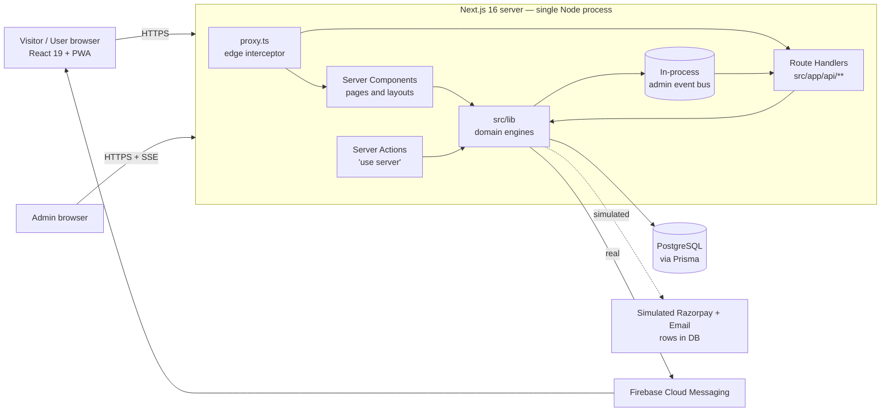

Key ideas:

1. **Server Components read, Server Actions write.** Pages (`page.tsx`, `layout.tsx`) are async server
   components that query Prisma directly (usually through a `src/lib` helper). User-driven mutations are
   **Server Actions** (`"use server"` files named `actions.ts` next to the page that uses them). Only six
   `route.ts` files exist, for things that genuinely need raw HTTP (file downloads, SSE stream, refresh
   endpoint, push registration, receipt PDF).
2. **Business logic lives in `src/lib`, not in actions.** Money-moving flows are in engine modules
   (`payment-engine`, `redemption-engine`, `commission-engine`, `interest-engine`,
   `autopay-scheduler`, `instalment-reminder`). Actions are thin: authenticate → validate → call engine →
   audit → notify → revalidate/redirect. Several admin CRUD actions (catalog, plans, theme, About/Contact)
   still hold their logic inline; extract it into `src/lib` when you need to reuse it.
3. **One database, one ledger.** All persistent state is PostgreSQL. Derived values (redeemable balance,
   available margin, dashboard metrics, reports) are computed from ledger/transaction rows on demand —
   never stored as independent counters.
4. **No background workers.** Anything a production system would run on a schedule (AutoPay charges,
   retries, maturity, reminders, expiry, retention) is an **admin-triggered batch action** — see 7.12.

### 4.2 Request lifecycle for a protected page

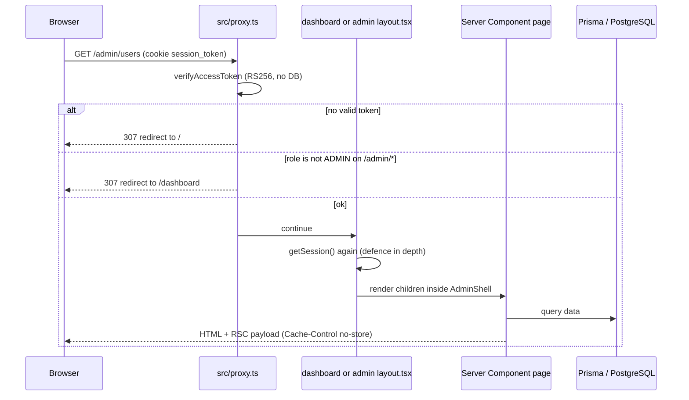

Authorization is enforced in **three layers** (do not remove any of them):

1. `src/proxy.ts` — cheap token check on `/dashboard/*` and `/admin/*` (also hosts the Basic-Auth gate for
   the API docs).
2. `dashboard/layout.tsx` and `admin/layout.tsx` — server-side session/role check on every render.
3. **Every Server Action and Route Handler re-checks** `getSession()` and the role/ownership itself.
   Never trust that a UI element was hidden; actions are directly invocable.

### 4.3 Session model

| Cookie | Content | Lifetime | Notes |
|---|---|---|---|
| `session_token` | RS256 JWT `{ sub: userId, role, sessionId }` | 30 min (`JWT_ACCESS_TOKEN_TTL_MIN`), or 400 days when "Remember me" | `httpOnly`, `sameSite=lax`, `secure` in production |
| `refresh_token` | Opaque 32-byte random value (SHA-256 hash stored in `RefreshToken`) | 30 days, or 400 days when remembered | Single-use, rotated on every refresh |
| `pending_2fa_token` | Short JWT proving "password OK, OTP pending" | 10 min | Only exists between `/login` and `/verify-2fa` |

`SessionKeepAlive` (mounted in the root layout) calls `POST /api/auth/refresh` every 25 minutes. The
endpoint rotates the refresh token and re-issues the session cookie; presenting an already-rotated token
revokes **all** of that user's refresh tokens and raises an admin alert. `sessionId` is the `LoginHistory`
row id, which gives logout and the login-history page something to attach to.

### 4.4 Browser caching and back-button behavior

Logged-in/out state must never be served from a cache, so several layers cooperate:

- `next.config.ts` sends `Cache-Control: no-store` for `/`, auth pages, `/dashboard/*`, `/admin/*`.
- `BfcacheGuard` (client component in the root layout) calls `router.refresh()` on `pageshow`
  (bfcache restore) and `popstate`, re-running the server-side session check after Back/Forward.
- Auth Server Actions use `redirect(..., "replace")` so Back cannot return to `/login`, `/verify-2fa`
  or a pre-logout page.
- `public/sw.js` never caches anything under `/dashboard`, `/admin`, `/api/` or auth routes (13).

### 4.5 Layout composition

```
src/app/layout.tsx            root: fonts, theme CSS variables, OfflineBanner, BfcacheGuard,
                              SessionKeepAlive, ServiceWorkerRegister
├── (public + (auth) pages)   SiteNav / AuthShell
├── dashboard/layout.tsx      session gate → DashboardShell (sidebar, bell, mobile nav)
└── admin/layout.tsx          session + ADMIN gate → AdminShell (grouped sidebar, live-event toasts)
```

The theme (colors, fonts, radius, login branding) is read from the **published** `ThemeConfig` row in the
root layout on every request and injected as CSS variables, so a theme publish is visible immediately
with no client fetch or flash of default styling.

---

## 5. Project structure

Only version-controlled content is listed.

```
.
├── package.json              scripts, dependencies (Next 16, Prisma 6, Playwright…)
├── next.config.ts            no-store headers, Server Action body limit (8 MB)
├── playwright.config.ts      test projects (regression + walkthrough/responsive recordings)
├── eslint.config.mjs · postcss.config.mjs · tsconfig.json
├── prisma/
│   ├── schema.prisma         the data model — single source of truth for tables/enums
│   ├── migrations/           ordered SQL migrations (apply with `prisma migrate deploy`)
│   └── seed.ts               idempotent demo data
├── public/
│   ├── sw.js                 hand-written service worker
│   ├── icons/                PWA icons (generated by scripts/generate-pwa-icons.mjs)
│   ├── branding/ · uploads/  logo / login-wallpaper assets served as static files
│   └── openapi.yaml          OpenAPI 3 spec for the route handlers (section 14)
├── scripts/                  manual one-off Node scripts (JWT keys, PWA icons, FCM check, video stitching)
├── tests/                    Playwright specs, helpers, custom reporter
└── src/
    ├── proxy.ts              edge interceptor: /dashboard + /admin auth, API-docs basic auth
    ├── app/                  routes (App Router)
    │   ├── layout.tsx · page.tsx · globals.css · manifest.ts
    │   ├── (auth)/           login, register, verify-2fa, forgot/reset-password, Google login
    │   ├── plans/            public catalog + [planId]/subscribe
    │   ├── franchisee/ · about/ · contact/   public pages (+ contact form action)
    │   ├── dashboard/        member area: account, payments, redeem/*, referrals,
    │   │                     notifications, verify-email
    │   ├── admin/            admin area: account, audit-log, catalog/*, commissions, emails,
    │   │                     enquiries/general, interest-methods, ledger, notifications,
    │   │                     payments (simulator), plans, redemptions, referrers, reports,
    │   │                     settings (+about-us, contact-us), theme, users
    │   ├── api/              the six route handlers (section 14)
    │   └── api-docs/         Swagger UI page (basic-auth gated)
    ├── components/           shells (DashboardShell, AdminShell, AuthShell), navs, ui/ primitives,
    │                         AdminLiveEvents, push opt-in/toggle, SessionKeepAlive, BfcacheGuard,
    │                         OfflineBanner, ServiceWorkerRegister, SwaggerUIEmbed…
    └── lib/                  all server-side domain logic (table below)
```

A typical feature folder looks like this — learn the pattern once and it repeats everywhere:

```
src/app/dashboard/redeem/
├── page.tsx           server component: loads data via src/lib, renders the hub
├── layout / sub-pages course/ donation/ gadgets/ …  one folder per category
├── actions.ts         "use server" — thin wrappers around redemption-engine
└── *Form.tsx          "use client" forms using useActionState(action, initialState)
```

### 5.1 `src/lib` module map

| Module | Responsibility |
|---|---|
| `prisma.ts` | Prisma client singleton (pinned to `globalThis` to survive hot reload) |
| `auth/jwt.ts` | Sign/verify RS256 access token and pending-2FA token (`jose`) |
| `auth/session.ts` | Cookie helpers: `createSession`, `getSession`, refresh/pending-2FA cookies |
| `auth/refresh-token.ts` | Issue / rotate / revoke refresh tokens, reuse detection |
| `auth/otp.ts` | Create and verify OTPs (login 2FA, email verify, password reset), resend limits |
| `auth/password.ts` · `auth/logout.ts` | bcrypt helpers + password policy regex · full server-side logout |
| `config.ts` | **Admin-tunable business settings**: defaults, ranges, `getSettings()` / `updateSettings()` |
| `payment-engine.ts` | Charge processing, webhook-signature gate, retries, manual payment fallback, posting payments to the ledger |
| `autopay-scheduler.ts` | Finds plans whose instalment is due and charges them (admin-triggered) |
| `providers/razorpay.ts` | **Simulated** gateway: fake IDs, deterministic outcomes, HMAC webhook signing/verification |
| `providers/email.ts` · `providers/notification.ts` | Simulated email outbox · notification row + FCM push |
| `push/fcm.ts` · `push/preferences.ts` · `firebase/*` | Real FCM delivery, opt-out handling, Firebase client/admin init |
| `interest-engine.ts` | Interest formulas (simple/compound/custom with a safe evaluator), maturity transition batch |
| `commission-engine.ts` | Accrues referral commission on successful payments |
| `redemption-engine.ts` | Redeemable balance, reservations, available margin, create/approve/reject/cancel/expire redemptions |
| `instalment-reminder.ts` | Upcoming-instalment reminders (email + push), de-duplicated |
| `dashboard.ts` | Data for the user dashboard, shell badges and admin dashboard |
| `ledger.ts` · `reports/index.ts` · `reports/export.ts` · `receipts.ts` | Ledger filters · 11 report definitions · CSV/XLSX/PDF writers · donation receipt PDF |
| `events/admin-events.ts` | In-process pub/sub that feeds the admin SSE stream |
| `audit.ts` | `logAudit()` — append-only audit trail |
| `theme.ts` · `branding-assets.ts` | Theme model, CSS-variable generation, accessibility checks · safe asset lookup |
| `general-enquiry-antispam.ts` · `general-enquiry-retention.ts` | Contact-form throttling/duplicate detection · PII anonymisation batch |
| `referral-code.ts` · `range-generator.ts` · `money.ts` · `format.ts` | Unique 8-char code generation · numeric/cadence range helpers · Round-Half-Up & ceiling · INR formatting |
| `validation/*` | Zod schemas (auth, enquiry, About Us, Contact Us) |

---

## 6. Data model

All tables are defined in `prisma/schema.prisma` (read the comments there — most fields explain the rule
behind them). Money columns are `Decimal(14,2)`; the code converts to `number` for arithmetic and always
rounds with `roundHalfUp` (`src/lib/money.ts`).

### 6.1 Entity relationship overview

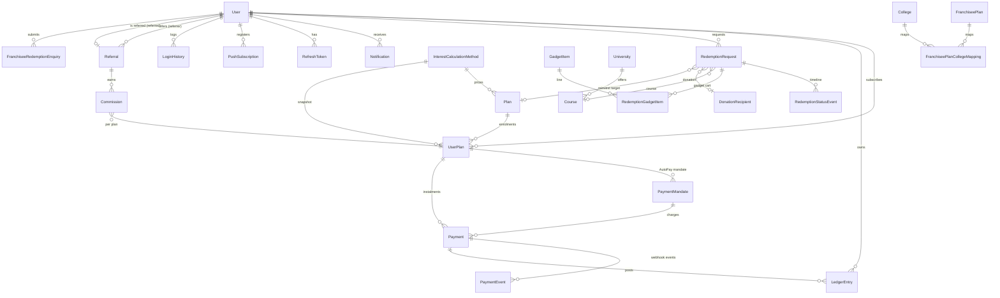

Other tables: `SocialAccount` (Google login), `OtpCode`, `SiteSetting` (key/value overrides for
`config.ts`), `EmailMessage` (simulated outbox), `AuditLog`, `GeneralEnquiry`, `AboutUsSectionDraft` /
`AboutUsSectionPublished`, `ContactUsContent`, `ThemeConfig`.

### 6.2 State machines

**Plan (`PlanStatus`)** `ACTIVE ⇄ DISCONTINUED` — toggled by an admin. Discontinuing blocks new
enrolment and cascades enrolled `UserPlan`s `ACTIVE → DISCONTINUED`; they are still honored to maturity.
Reactivating reverses only the UserPlans that cascade moved.

**UserPlan (`UserPlanStatus`)**

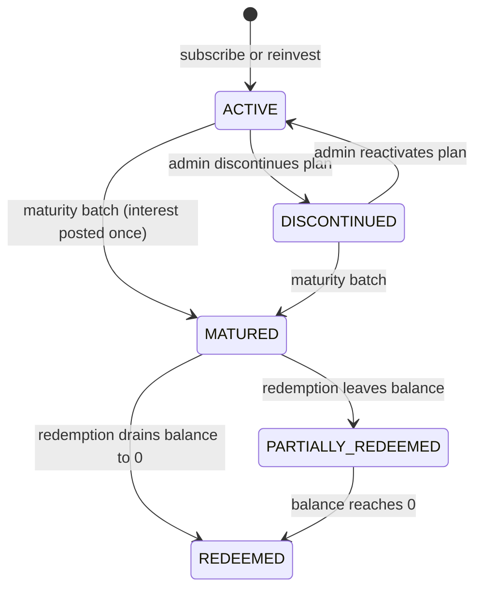

**Payment (`PaymentStatus`)**

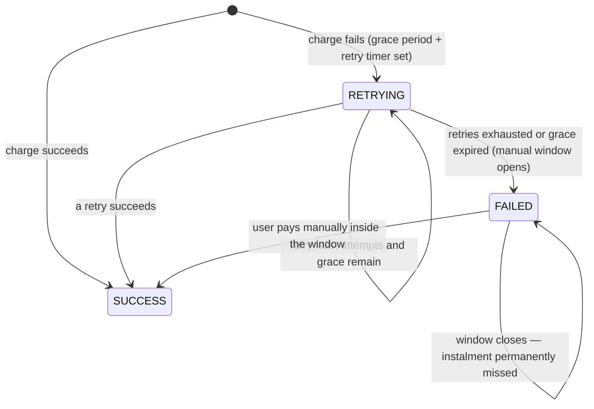

**Commission (`CommissionStatus`)**

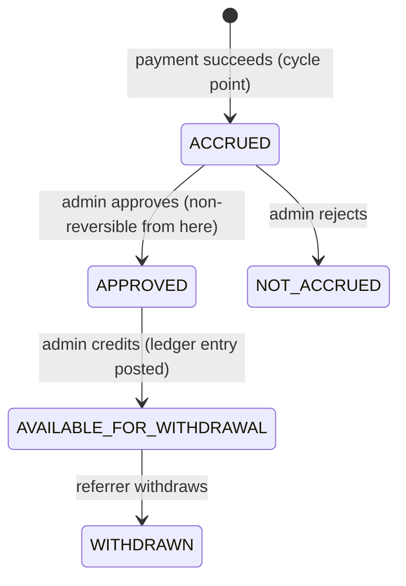

(`CREDITED` exists in the enum, but the prototype performs credit + availability as one atomic admin
action.)

**Redemption request (`RedemptionStatus`)**

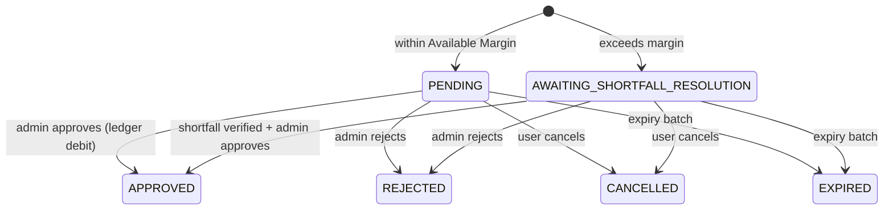

**Theme (`ThemeStatus`)** `DRAFT → PUBLISHED → ARCHIVED`; publish, rollback and reset all create a *new*
published version and archive the previous one (see 7.14).

---

## 7. Functional flows

Each flow lists the entry point, the files that implement it, and what is persisted.

### 7.1 Registration (with optional referral)

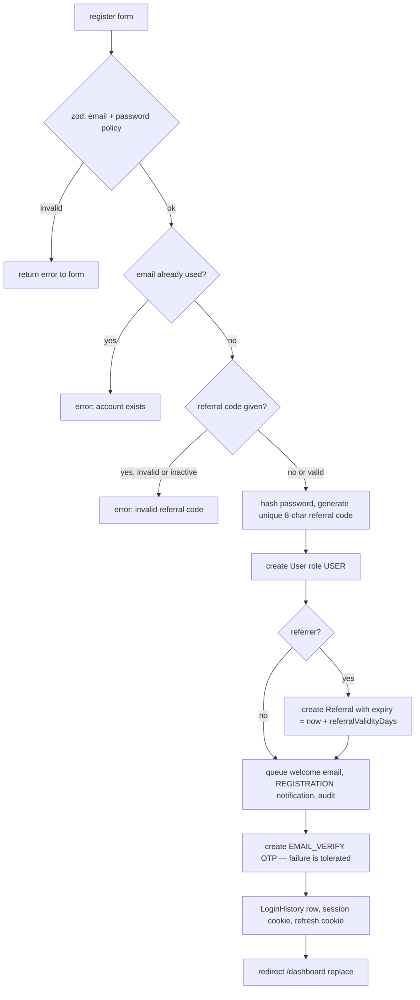

Files: `src/app/(auth)/actions.ts#registerAction`. Registration logs the user straight in — **2FA applies to
login only**. Email verification is a separate, optional step at `/dashboard/verify-email`.

### 7.2 Login with 2FA

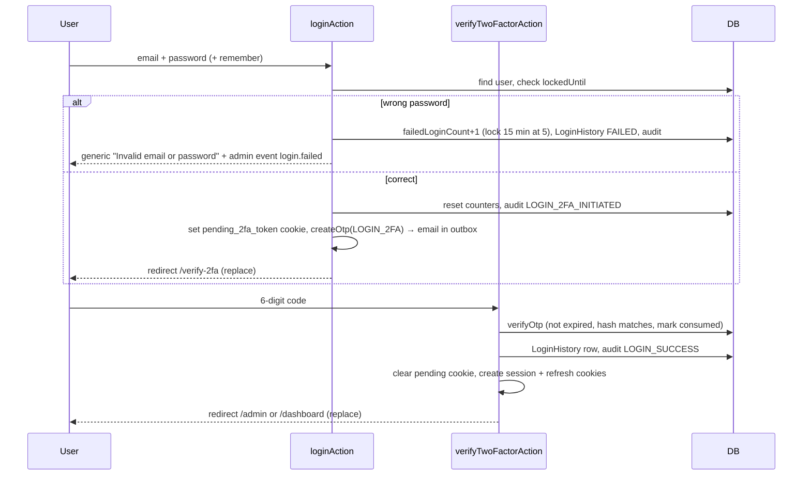

OTP rules (`auth/otp.ts`, tunables in `config.ts`): validity 5 min, max 3 sends per 15-minute window per
purpose, wrong codes are counted but never lock the code. Google "social login" (`login/social/google`)
is **simulated** (there is no real OAuth round trip): it finds, links or creates the user and a
`SocialAccount` by email (honouring an optional referral code on first sign-up) and then goes through the
same pending-2FA step — social authentication does not bypass 2FA.

### 7.3 Forgot / reset password and email verification

- `forgot-password` creates a `PASSWORD_RESET` OTP (30-minute validity) and always answers generically so
  accounts cannot be enumerated. `reset-password` verifies it, sets a new password, **revokes every
  refresh token** and destroys the session.
- `dashboard/verify-email` creates / verifies an `EMAIL_VERIFY` OTP and sets `isEmailVerified`.
- Changing the password from the account page also revokes all refresh tokens.

### 7.4 Session refresh and logout

`SessionKeepAlive` → `POST /api/auth/refresh` → `rotateRefreshToken`: unknown token → 401; revoked token
presented again → **all sessions revoked** + `TOKEN_REUSE_DETECTED` audit + admin alert; expired → 401;
valid → old token marked revoked (`replacedByTokenHash` set), new token + new access JWT issued, same
`sessionId` kept by looking up the user's latest open `LoginHistory`. `logoutAction` →
`performServerLogout` revokes the refresh token, stamps `LoginHistory.logoutAt`, clears cookies and
`revalidatePath("/", "layout")` so the public nav flips to logged-out immediately.

### 7.5 Subscribing to a plan

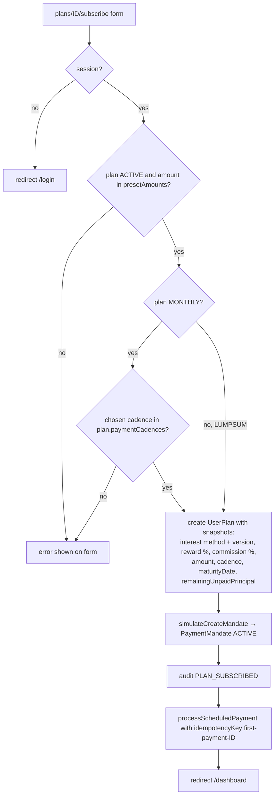

`subscribeToPlanAction` (`src/app/plans/[planId]/actions.ts`). The first instalment is charged
immediately through the same engine used for scheduled charges.

### 7.6 Payment processing (AutoPay, retry, manual fallback)

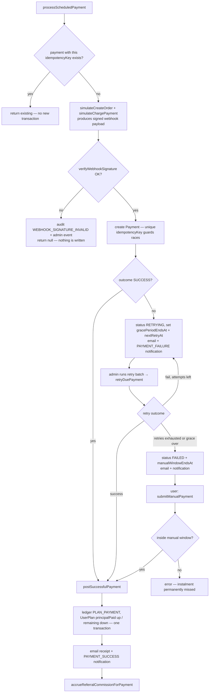

Files: `payment-engine.ts`, `autopay-scheduler.ts`, `providers/razorpay.ts`,
`dashboard/payments/actions.ts`, `admin/payments/actions.ts`. Every outcome writes a `PaymentEvent` with
`signatureVerified`. Duplicate protection has three layers: idempotency-key lookup, unique DB
constraints (a `P2002` race is converted into "return the winner"), and the single ledger posting in
`postSuccessfulPayment`.

**Due-date logic** (`findDuePlans`): a MONTHLY, ACTIVE plan with an ACTIVE mandate and remaining
principal is due when `lastResolvedPayment.createdAt + cadence <= now`, unless an earlier instalment is
still RETRYING or FAILED-inside-its-manual-window.

### 7.7 Referral commission lifecycle

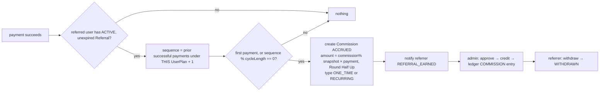

- Cycle position is counted **per UserPlan**, never across a user's other plans.
- Cancelling a referral (admin, with a mandatory reason) or letting it expire stops *future* accrual only;
  accrued/approved commission is never reversed.
- "Referral Earnings" (user dashboard) = CREDITED + AVAILABLE_FOR_WITHDRAWAL + WITHDRAWN; "Referral
  Payout" (admin dashboard) = WITHDRAWN only.

### 7.8 Interest and plan maturity

Interest is calculated **once, at maturity** (`runMaturityTransitions`, admin-triggered): for every
ACTIVE/DISCONTINUED UserPlan with `maturityDate <= now`, inside a transaction (re-checked to avoid
double posting) it calculates interest from the **snapshotted** method/version, posts one `INTEREST`
ledger entry, sets the plan `MATURED`, and notifies the user (email + notification). Matured principal
plus interest then becomes redeemable because it no longer counts as locked principal. Formula types:
`SIMPLE`, `COMPOUND` (annual/semi/quarterly/monthly), `CUSTOM` (restricted expression evaluator —
variables `Principal`, `Rate`, `Tenure`, `ElapsedDays`; length/nesting limited; negative/NaN results become 0).

### 7.9 Redemption (the money-out flow)

Six categories share one engine: **COURSE** (with Reward Points), **REFUND**, **REINVESTMENT** (opens a
new UserPlan), **DONATION** (recipient + consent, PDF receipt, `DON-` reference), **GADGETS** (multi-item
cart with stock reservation) and **FRANCHISEE** (separate `FranchiseeRedemptionEnquiry` model: franchisee
plan + college).

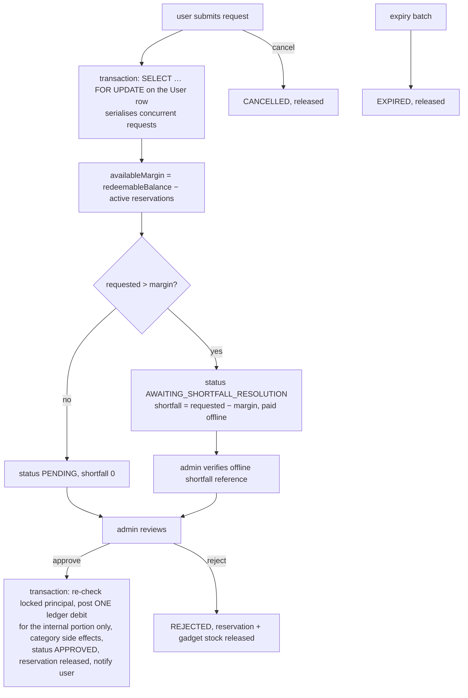

Rules worth knowing before you touch this code:

- A pending **COURSE** request is intentionally *not* counted in reservations (explicit product decision —
  documented in `getTotalActiveReservations`).
- The ledger is debited **only at approval**, and only for `reservedAmount − shortfallAmount`; the
  offline shortfall never touches the ledger.
- Approval re-checks that the debit does not dip into locked principal — margin can shift between
  submission and approval.
- Approval side effects by category: GADGETS decrement stock and reservation; REINVESTMENT creates a
  fully-funded UserPlan; COURSE awards `ceil(courseFee × reward%)` Reward Points net of points spent;
  DONATION stores a reference so the receipt endpoint can render.
- Every state change appends a `RedemptionStatusEvent` (powers the user-visible timeline).
- Redemption expiry defaults to 7 days (`redemptionExpiryDays`).

### 7.10 Admin live updates

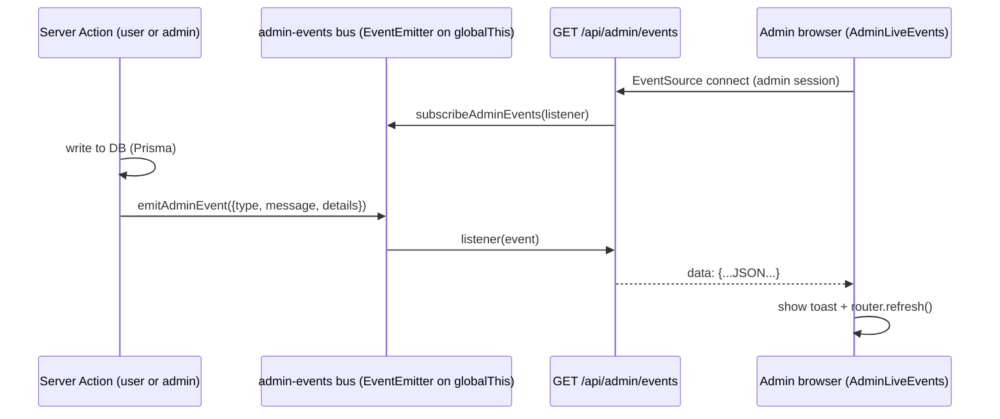

The SSE route only *streams*; it never writes. Events are fired by actions/engines after their DB write
(redemption requested/cancelled, franchisee enquiry, general enquiry, manual payment, invalid webhook
signature, refresh-token reuse, failed login, and each batch run). The route also sends a `: ping`
comment every 25 s. **The bus is in-process memory** — if you ever run more than one server instance, replace it with a
shared broker (Redis pub/sub) or an admin connected to instance A will never see events from instance B.

### 7.11 Notifications, email and push

`createNotification()` always writes the durable `Notification` row first (shown at
`/dashboard/notifications` and in the bell badge) and then attempts an FCM push; a push failure can never
roll back or duplicate the row. `queueEmail()` just stores an `EmailMessage` (status `SENT`) viewable at
`/admin/emails`. Push respects the per-user opt-out (`pushNotificationsEnabled`), sends to every active
device registration, revokes tokens FCM reports as dead, and keeps transient failures for diagnostics.
Notification links are built as **absolute** URLs from `NEXT_PUBLIC_APP_URL` (a relative link makes FCM
reject the payload).

### 7.12 Batch jobs (admin-triggered "cron")

| Job | Button location | Function |
|---|---|---|
| Run due AutoPay charges | `/admin/payments` | `runDueAutoPayCharges` |
| Run due payment retries | `/admin/payments` | `runDuePaymentRetries` |
| Simulate mandate expiry / cancellation | `/admin/payments` | `simulateMandateExpiryAction` / `…CancellationAction` |
| Run maturity transitions | `/admin/payments` | `runMaturityTransitions` |
| Send instalment reminders | `/admin/payments` | `runInstalmentReminders` |
| Expire stale redemptions | `/admin/redemptions` | `expireStaleRedemptionRequests` |
| General-enquiry retention (anonymise old PII) | `/admin/enquiries/general` | `runGeneralEnquiryRetention` |

The simulator can force an outcome (`SUCCESS`, `FAILED`, `PENDING`, `CANCELLED`, `EXPIRED`) and force an
invalid webhook signature to demonstrate the rejection path. To run these on a schedule in production,
call the same lib functions from a cron job or queue worker.

### 7.13 General enquiry (contact form)

`submitGeneralEnquiryAction` validates with zod, applies anti-spam (`general-enquiry-antispam.ts`: max 5
per IP per 15 min, 3 per email per hour, identical-message duplicate window of 10 min), stores a
`GeneralEnquiry`, notifies admins and emits `general_enquiry.submitted`. Admins change status at
`/admin/enquiries/general`; a retention batch anonymises PII older than `generalEnquiryRetentionMonths`
(default 24) while keeping rows so report counts stay intact.

### 7.14 Theme management

Admins edit a **draft** `ThemeConfig` (colors, fonts, radius, login branding/wallpaper) at `/admin/theme`.
Saving only touches the draft and returns accessibility warnings (contrast ratios). **Publish** archives
the current published row and creates a new `PUBLISHED` row with the next version number in one
transaction; **rollback** republishes an archived version as a new version; **reset** republishes defaults.
`RootLayout` reads the published row per request and injects it as CSS variables, so public pages, login
and the apps pick it up instantly. Free-text theme fields go through `sanitizeText`.

### 7.15 About Us / Contact Us content

Draft/publish content managed under `/admin/settings/about-us` and `/admin/settings/contact-us` (with
preview pages). Public pages read only the **published** copy; the About Us nav link appears only when at
least one published section exists. Content is sanitised with `sanitize-html`.

### 7.16 Reports and exports

`src/lib/reports/index.ts` defines 11 reports (`users`, `payments`, `interest`, `referrals`, `plans`,
`refunds`, `rewards`, `enquiries`, `general-enquiries`, `revenue`, `audit`) as `{ key, label, columns,
getRows() }`. `/admin/reports` lists them; `GET /api/admin/reports/{reportKey}?format=csv|xlsx|pdf`
serves downloads through `reports/export.ts`. `GET /api/admin/ledger/export` exports filtered ledger rows.

---

## 8. Scenario handling reference

How the code behaves in the situations a developer is most likely to ask about. "Where" points at the
function to read or change.

### 8.1 Authentication and accounts

| Scenario | Behavior | Where |
|---|---|---|
| Wrong password | Generic error; `failedLoginCount` +1; **5th consecutive failure locks the account 15 minutes**; `LoginHistory` row with result `FAILED`; audit `LOGIN_FAILED`; admin live toast | `loginAction` |
| Correct password while locked | Rejected with a "temporarily locked" message | `loginAction` |
| Unknown email at login / forgot-password | Same generic message (no account enumeration) | `loginAction`, `forgotPasswordAction` |
| OTP expired | Code consumed, user asked to request a new one | `verifyOtp` |
| Wrong OTP | Error returned; attempt counter incremented but **the code is not invalidated** (no attempt limit by design) | `verifyOtp` |
| Too many OTP requests | `createOtp` throws after `otpMaxResends` in `otpResendWindowMinutes`; surfaced as a form error | `createOtp` |
| Opening `/verify-2fa` without a pending-2FA cookie | Redirect to `/login` | `verifyTwoFactorAction` |
| Duplicate email on register | "An account with this email already exists" | `registerAction` |
| Invalid / deactivated referral code on register | Registration blocked with an error | `registerAction` |
| Refresh token reused after rotation | All of the user's refresh tokens revoked, `TOKEN_REUSE_DETECTED` audit + admin alert, 401 | `rotateRefreshToken` |
| Password changed or reset | Every refresh token revoked, session destroyed | account / reset actions |
| Admin locks a user | `lockedUntil` set; user cannot log in until unlocked | `admin/users` `toggleUserLockAction` |
| Back button after login/logout | `redirect(..., "replace")` + `BfcacheGuard` + `no-store` headers | auth actions, `BfcacheGuard` |

### 8.2 Plans, payments and AutoPay

| Scenario | Behavior | Where |
|---|---|---|
| Subscribing to a discontinued/unknown plan, an amount not in `presetAmounts`, or a cadence not offered | Form error, nothing created | `subscribeToPlanAction` |
| Admin edits a plan or interest method after users subscribed | No effect on existing UserPlans (snapshotted interest method/version, reward %, commission %) | `UserPlan` snapshot columns |
| Admin discontinues a plan | New enrolment blocked; existing UserPlans → `DISCONTINUED` but honored to maturity; reactivating reverses only that cascade | `togglePlanStatusAction` |
| Same payment initiated twice (same idempotency key) | Existing payment returned; no second ledger entry, commission or notification | `processScheduledPayment` |
| Two concurrent requests with one idempotency key | DB unique-constraint error `P2002` is caught and the winning payment is returned | `processScheduledPayment` |
| Webhook signature invalid | Nothing written (no payment, ledger, commission); audit `WEBHOOK_SIGNATURE_INVALID` + admin alert | `verifyWebhookSignature` call sites |
| Charge fails | `RETRYING` with grace deadline and next-retry time; failure email + notification | `processScheduledPayment` |
| Retries exhausted or grace period over | `FAILED`, manual-payment window opens (`manualPaymentWindowHours`) | `retryDuePayment` |
| User pays after the manual window | Rejected — instalment stays missed; plan is **not** suspended | `submitManualPayment` |
| Next instalment while the previous one is unresolved | Scheduler skips that plan | `findDuePlans` |
| Mandate expired/cancelled | Plan is skipped by the scheduler (needs an `ACTIVE` mandate) | `findDuePlans`, simulator actions |
| Payment amounts / interest rounding | Always Round-Half-Up to 2 dp; avoid raw float arithmetic on balances | `roundHalfUp` |

### 8.3 Referrals and commission

| Scenario | Behavior | Where |
|---|---|---|
| Referral expired (`expiryDate` passed) or cancelled | No new commission; existing commission continues its lifecycle | `accrueReferralCommissionForPayment` |
| First payment under a UserPlan | `ONE_TIME` commission | same |
| Every Nth successful payment (default 4) under the same UserPlan | `RECURRING` commission | same |
| Failed payments | Do not advance the cycle (only SUCCESS payments are counted) | same |
| Reject a commission | Only possible while `ACCRUED` (→ `NOT_ACCRUED`); once `APPROVED` it is non-reversible | `rejectCommissionAction` |
| Withdraw commission | Only the referrer, only from `AVAILABLE_FOR_WITHDRAWAL` | `withdrawCommissionAction` |
| Regenerate referral code | Old code stops working for new sign-ups; existing relationships are unaffected | `regenerateReferralCodeAction` |
| Admin cancels a referral | Reason is mandatory; audit `REFERRAL_CANCELLED` | `cancelReferralAction` |

### 8.4 Redemptions

| Scenario | Behavior | Where |
|---|---|---|
| Request ≤ Available Margin | `PENDING`, amount reserved | `createRedemptionRequest` |
| Request > Available Margin | Accepted anyway as `AWAITING_SHORTFALL_RESOLUTION`; shortfall paid offline and verified by an admin (reference required) | `createRedemptionRequest`, `verifyRedemptionShortfall` |
| Approving before the shortfall is verified | Throws "Shortfall must be verified before approval" | `approveRedemptionRequest` |
| Two requests at once from one user | Serialised with `SELECT … FOR UPDATE` on the user row so margin is never double-spent (pending COURSE requests excepted, see 7.9) | `createRedemptionRequest` |
| Approval would dip into principal locked in unmatured plans | Approval throws; nothing is written | `approveRedemptionRequest` |
| Gadget out of stock / over-reservation | Reservation uses an atomic conditional update, so concurrent carts cannot over-reserve | `createGadgetCartRedemptionRequest` |
| Reject / cancel / expire a gadget request | Reserved stock released | reject / cancel / expire functions |
| Request left untouched | Expires after `redemptionExpiryDays` via the batch job; reservation released, user notified | `expireStaleRedemptionRequests` |
| Partial vs full redemption of a matured plan | `PARTIALLY_REDEEMED` while redeemable balance remains, `REDEEMED` at exactly 0 | `approveRedemptionRequest` |
| Receipt requested for a non-approved/non-donation request | 400; for someone else's request 403 (admins allowed) | `GET /api/redemptions/{id}/receipt` |

### 8.5 Content, enquiries and platform

| Scenario | Behavior | Where |
|---|---|---|
| Contact form spam (IP/email flood, identical messages) | Throttled or flagged duplicate | `checkGeneralEnquiryAntiSpam` |
| Old general enquiries | Anonymised (name/email redacted, rows kept) by the retention batch | `runGeneralEnquiryRetention` |
| Theme with poor contrast | Saved, but accessibility warnings returned to the editor | `checkAccessibility` |
| Branding asset file missing on disk | Falls back to the default instead of a broken image | `existingPublicAsset` |
| Firebase not configured / push provider down | Delivery skipped and logged; the `Notification` row is unaffected | `sendFcmPush` |
| User opted out of push | Delivery gated per user; new device registrations are not stored while opted out | `sendFcmPush`, `POST /api/push/subscribe` |
| Browser offline | `OfflineBanner` appears; the service worker never fabricates a success response | `OfflineBanner`, `public/sw.js` |
| Database unreachable | Pages that query it return 500 (there is no graceful-degradation UI yet) | — |

---

## 9. Configurable business settings

Admins edit these at **`/admin/settings`**. Values are stored as strings in `SiteSetting` and merged over
the code defaults by `getSettings()` (`src/lib/config.ts`). Every update is range-validated and audited
(`SITE_SETTINGS_UPDATED`). The form is generated from `SETTINGS_SCHEMA`, so a new key appears
automatically.

| Key | Default | Range | Used by |
|---|---|---|---|
| `referralValidityDays` | 365 | 30–1095 | Referral expiry computed at registration |
| `redemptionExpiryDays` | 7 | 1–30 | Redemption `expiresAt` |
| `paymentGracePeriodHours` | 24 | 0–168 | Grace deadline on a failed charge |
| `paymentRetryCount` | 3 | 1–5 | Max automatic retries |
| `paymentRetryIntervalHours` | 24 | 1–72 | Delay between retries |
| `manualPaymentWindowHours` | 24 | 1–72 | Manual payment window after retries end |
| `shortfallVerificationSlaHours` | 24 | 1–72 | Defined and editable, **not enforced anywhere in code** (informational SLA) |
| `commissionRecurringCycleLength` | 4 | 1–24 | Every Nth payment earns recurring commission |
| `commonRewardPercent` | 5 | 0–100 | Fallback reward % when a plan has none |
| `otpTtlMinutes` | 5 | 1–30 | OTP validity (login / email verify) |
| `passwordResetTtlMinutes` | 30 | 5–120 | Password-reset OTP validity |
| `otpMaxResends` | 3 | 1–10 | OTP sends per window |
| `otpResendWindowMinutes` | 15 | 5–120 | The window above |
| `generalEnquiryRetentionMonths` | 24 | 1–120 | Retention batch cutoff |
| `instalmentReminderLeadDays` | 3 | 1–14 | How early reminders are sent |

Not configurable (hard-coded): account lockout (5 failures → 15 min), refresh-token lifetime (30 days /
400 remembered), pending-2FA lifetime (10 min), anti-spam thresholds, FCM link mapping.

---

## 10. Security model

| Area | Implementation |
|---|---|
| Passwords | bcrypt hashes only; policy regex in `auth/password.ts` (min 8, upper, lower, digit, special) |
| Access token | RS256 JWT (`jose`); private key never leaves the server; verified in `proxy.ts` without a DB hit |
| Refresh token | Random 32 bytes, stored as SHA-256 hash, single use, rotated, reuse ⇒ revoke-all |
| Cookies | `httpOnly`, `sameSite=lax`, `secure` in production |
| RBAC | Three layers (proxy → layout → per-action/handler). Admin-only actions call a local `requireAdmin()` or check `session.role` |
| Input validation | zod at every Server Action boundary; Prisma parameterises all queries; raw SQL is limited to the `FOR UPDATE` row lock |
| Admin-authored HTML/text | `sanitize-html` / `sanitizeText` |
| Payments | No card data anywhere; the gateway is simulated; webhook payloads are HMAC-SHA256 signed and verified with a timing-safe compare *before* any business processing |
| Audit | `logAudit()` records security- and money-relevant events (logins, token events, approvals, settings, theme, plan changes) |
| Caching | `no-store` on session-dependent routes; service worker never caches authenticated routes |
| API docs | HTTP Basic Auth in `proxy.ts` |

**Known security shortcuts (fix before production):**

1. **Fixed demo OTPs** — `otpCodeForUser()` returns `000000` (admin) / `111111` (everyone else) and the
   OTP email is readable by admins. Replace with random codes and a real mail provider.
2. **Simulated Google login** accepts an email without a real OAuth exchange.
3. **No rate limiting** on login/register beyond the per-account lockout (the contact form is the
   exception).
4. **Default API-docs credentials** are published in this README — always override them.
5. **OTP verification attempts are unlimited** within an OTP's lifetime (a product decision recorded in
   `verifyOtp`).

---

## 11. Developer guide

### 11.1 Ground rules and conventions

- **Where does code go?** Reusable/domain logic → `src/lib/<module>.ts`. Anything tied to one screen →
  next to that route (`actions.ts`, `*Form.tsx`). Do not put business rules in components.
- **Server vs client.** Default to server components. Add `"use client"` only for interactivity
  (`useActionState`, `useEffect`, event handlers). Forms call Server Actions through
  `useActionState(action, initialState)`; actions return `{ error?: string; ... }` for validation
  failures and call `redirect()` on success.
- **Authorize inside every action.** `const session = await getSession(); if (!session) redirect("/login");`
  plus role/ownership checks. Admin files define `requireAdmin()`.
- **Mutate, then side-effects, then redirect.** The established order is: validate (zod) → engine call →
  `logAudit()` → `createNotification()` / `queueEmail()` → `emitAdminEvent()` (if admins should know) →
  `revalidatePath()` → `redirect()`. `redirect()` throws, so anything after it never runs.
- **Money.** Use `Decimal` columns, convert with `Number()`, round with `roundHalfUp`, format with
  `formatINR`. Post money only through ledger entries computed from the *latest* `balanceAfter` inside a
  `prisma.$transaction`.
- **Snapshots over joins.** When a later admin edit must not affect existing records, copy the value
  onto the record (see `UserPlan`). Follow that pattern for new rule-bearing data.
- **Comments.** Keep the existing "why" comments (they cite the requirement a rule came from). Write a
  comment only for non-obvious reasons.
- **Imports** use the `@/` alias for `src/`.

### 11.2 Recipes

**Add a Server Action**
1. Create or extend `actions.ts` beside the page; start the file with `"use server"`.
2. Parse `FormData` with a zod schema; return `{ error }` on failure.
3. Check the session and role/ownership.
4. Call a `src/lib` function for the real work (create one if the logic is non-trivial).
5. `logAudit(...)`, notify, `revalidatePath(...)` or `redirect(...)`.
6. Add a Playwright spec (see 11.3).

**Add a page**
1. Create `src/app/<area>/<route>/page.tsx` (async server component).
2. Under `dashboard/` or `admin/` the layouts already authenticate; still gate any role-specific content.
3. Add a nav entry: `NAV_ITEMS` in `src/components/AdminShell.tsx`, or the list in
   `src/components/DashboardShell.tsx`.
4. New *public* pages go in `src/app/` and, if they belong in the top nav, in `SiteNav.tsx`.

**Change the database**
1. Edit `prisma/schema.prisma`.
2. `npx prisma migrate dev --name short_description` (uses `DIRECT_URL`). Commit the generated folder
   under `prisma/migrations/`.
3. Update `prisma/seed.ts` if demo data needs the new field, and any affected report in
   `lib/reports/index.ts`.
4. `npx prisma generate` is run by the migrate command; run it manually after pulling schema changes.

**Add a business setting**
Add an entry to `SETTINGS_SCHEMA` in `src/lib/config.ts` (label, default, min, max). It appears on
`/admin/settings` automatically; read it with `(await getSettings()).yourKey`.

**Add a notification type**
1. Add the value to `enum NotificationType` and create a migration.
2. Add its deep link to `linkForNotification()` in `src/lib/providers/notification.ts`.
3. Call `createNotification({ userId, type, title, message })` from your flow.

**Add an admin live event**
Add the string to `AdminEventType` (`src/lib/events/admin-events.ts`), call
`emitAdminEvent({ type, message, details })` after your DB write, and (optionally) adjust the severity
rules in `src/components/admin/AdminLiveEvents.tsx`.

**Add a report**
Append a `ReportDefinition` (`key`, `label`, `columns`, `getRows`) and add it to `reportDefinitions` in
`src/lib/reports/index.ts`. The `/admin/reports` page and the export route pick it up automatically; add
the key to `public/openapi.yaml` and section 14.

**Add a REST route handler**
Create `src/app/api/<path>/route.ts` exporting `GET`/`POST`/…; check `getSession()` and role; return
`NextResponse.json({ error }, { status })` on failure. Then document it in `public/openapi.yaml` and in
section 14 of this README. Prefer a Server Action unless you need raw HTTP semantics (downloads, SSE,
external callers).

**Add a redemption category**
Extend `RedemptionCategory` and `LedgerTransactionType` (migration), add the category to
`LEDGER_TYPE_BY_CATEGORY` in `redemption-engine.ts`, handle any approval-time side effects in
`approveRedemptionRequest`, add `dashboard/redeem/<category>` page + form + action, and surface it in the
admin redemptions view and reports.

**Add an interest formula type**
Extend `InterestFormulaType`, handle it in `calculateInterest()` (`interest-engine.ts`) and in the
interest-method admin form/validation. Remember existing methods are versioned — revise rather than edit.

**Replace a simulated provider with a real one**
See [section 15](#15-simulated-email-and-payments-and-how-to-integrate-real-providers) for exactly what
each simulated piece does today and the concrete file-by-file changes needed to replace it.

### 11.3 Where to look when…

| Symptom / task | Start here |
|---|---|
| A page redirects unexpectedly | `src/proxy.ts`, then the layout for that area, then the page's own `redirect()` calls |
| Wrong balance or margin | `redemption-engine.ts` (`getRedeemableBalance`, `getAvailableMargin`) and `LedgerEntry` rows |
| A payment is stuck | `Payment.status`, `nextRetryAt`, `gracePeriodEndsAt`, `manualWindowEndsAt`; then `payment-engine.ts` |
| Commission missing | Referral status/expiry, `commission-engine.ts` cycle logic, the Commission row's `cyclePosition` |
| Admin does not see live events | Event emitted? (`emitAdminEvent` call) → SSE route open? → single-process caveat (7.10) |
| Push not delivered | `PushSubscription.revokedAt/lastError`, `pushNotificationsEnabled`, Firebase env vars, absolute link in `notification.ts` |
| Styling looks stale in dev | Service worker registered in dev? (`NEXT_PUBLIC_ENABLE_SW_IN_DEV`) — unregister it |
| Everything 500s | PostgreSQL not running, or `DATABASE_URL` / database name wrong (3.2) |
| Back button shows stale auth state | `BfcacheGuard`, `next.config.ts` headers, `redirect(..., "replace")` usage |

### 11.4 Common pitfalls

- **Next.js 16 differs from older docs** — consult `node_modules/next/dist/docs/` when an API behaves
  unexpectedly.
- **`redirect()` inside `try/catch`** is swallowed. Call it outside the `try`.
- **Server Action body limit** is raised to 8 MB in `next.config.ts` for branding uploads; keep new
  uploads under that.
- **Hot-reload singletons.** Prisma and the admin event bus are pinned to `globalThis`. A plain
  module-level singleton is *duplicated* between Server Action and Route Handler bundles.
- **Decimals.** Prisma `Decimal` → `Number()` introduces float noise; always `roundHalfUp` before
  comparing or storing.
- **Absolute URLs for push links.** Relative links make FCM reject the whole message.
- **Do not cache authenticated routes** in the service worker (`NETWORK_ONLY_PREFIXES` in `public/sw.js`).
- **Public asset URLs** under `public/` must exist at runtime; they are plain files on the local disk, so keep them in
  place when moving the project.

---

## 12. Testing

The suite is Playwright-based (`playwright.config.ts`), runs serially (`workers: 1`) against a **running
app and the real database**, and records video for every test.

```bash
npm test                       # whole suite
npm run test:e2e:headed        # watch the browser
npm run test:e2e:debug         # Playwright inspector
npm run test:e2e:report        # open the last HTML report
```

If nothing is listening on port 3000, Playwright starts `npm run dev:http` itself (and reuses an
already-running server locally). The configured `baseURL` is `http://localhost:3000`, so if you keep an
HTTPS dev server (`npm run dev`) running instead, stop it or switch to `dev:http` before running tests.
Tests use the real database from your `.env`, so run them against a development project only.

| Folder | What it covers |
|---|---|
| `tests/browser/auth` | register, login + 2FA, RBAC, social login + 2FA |
| `tests/browser/account` | mobile number, password change, login history, push opt-out |
| `tests/browser/cross-role` | end-to-end flows spanning user + admin: subscribe → pay → retry → mature, reminders, account lock |
| `tests/browser/redemption` | every redemption category, shortfall, concurrency, partial/full, status timeline |
| `tests/browser/referral` | commission lifecycle, cancellation, expiry, code regeneration |
| `tests/browser/admin` | plans, interest methods, notifications, discontinuation cascade |
| `tests/browser/realtime` | admin live updates (SSE), push subscribe |
| `tests/browser/enquiries`, `content`, `theme`, `payments`, `negative`, `regression`, `responsive` | contact form, About/Contact content, theme lifecycle, payment details, negative paths, dashboard/report reconciliation, mobile layout |
| `tests/integration` | DB-level specs (webhook idempotency, commission cycle scoping) |
| `tests/browser/walkthrough` | narrated product walkthroughs recorded as videos (separate Playwright projects; see `tests/browser/walkthrough/README.md`) |

Conventions (see `tests/helpers.ts` and `tests/browser/fixtures.ts`):

- **Test Server Actions through the UI**, never with hand-built `curl`/`fetch` multipart requests — action
  IDs and the wire format are not stable.
- Submit forms with `Promise.all([page.waitForResponse(...), locator.click()])` so the assertion waits for
  the action round trip.
- Use `loginViaUi(page, email, password)`; the OTP is read from the simulated email via
  `getLatestOtpCode`.
- Create and clean up your own fixtures through the exported Prisma client in `tests/helpers.ts`.

`scripts/manual-fcm-verify.mjs` is a one-off, non-CI check of real push delivery — see `scripts/README.md`.

---

## 13. PWA, push notifications and real-time updates

**PWA.** `src/app/manifest.ts` serves `/manifest.webmanifest`; icons live in `public/icons/`
(regenerate with `node scripts/generate-pwa-icons.mjs`); `public/sw.js` is a hand-written service worker
registered by `ServiceWorkerRegister` (production builds only unless `NEXT_PUBLIC_ENABLE_SW_IN_DEV=true`).
Caching policy: shell assets cache-first, `/_next/static/` network-first with cache fallback,
**everything dynamic or authenticated network-only** (`/dashboard`, `/admin`, `/api/`, auth routes).
Bump `CACHE_NAME` in `sw.js` whenever the precache policy changes so stale entries are purged.
`OfflineBanner` shows connectivity loss. Manual test checklist: install on Android Chrome / iOS Safari /
desktop Chrome-Edge, verify standalone display, offline banner, no cached private pages after logout, and
cache refresh after a rebuild.

**Push (real FCM).** Flow: business event → `createNotification()` → `Notification` row → `sendFcmPush()` →
Firebase Admin `messaging.send()` to each active `PushSubscription`. The browser side
(`PushOptIn`, `PushNotificationToggle`, `lib/firebase/client.ts`, the service worker) requests permission
and registers the token with `POST /api/push/subscribe`. Setup needs the Firebase web config and VAPID key
(`NEXT_PUBLIC_FIREBASE_*`) plus a service-account JSON referenced by `FIREBASE_SERVICE_ACCOUNT_PATH`
(keep it out of git). Chrome inside sandboxed/headless environments can produce valid-looking tokens that
FCM later rejects — test on a normal desktop browser.

**Real-time admin updates.** SSE via `GET /api/admin/events` and the in-process event bus, described in
7.10.

---

## 14. API documentation

This app is primarily built on **Next.js Server Actions**, not a REST API — nearly all user/admin
mutations (subscribing to a plan, approving a redemption, managing users, etc.) are invoked directly
from React components via `"use server"` functions and have no HTTP-callable route. The only parts of
the app reachable as plain HTTP endpoints are the six route handlers under `src/app/api/**/route.ts`
(file/report downloads, the refresh-token endpoint, push-subscription management, the admin live-event
stream, and the donation receipt endpoint). Those are documented below and in a full OpenAPI spec.

### 14.1 Interactive docs (Swagger UI)

An interactive Swagger UI is served at **`/api-docs`**, backed by the raw OpenAPI spec at
**`/openapi.yaml`** (`public/openapi.yaml`). Both are gated by their own **HTTP Basic Auth**
credentials — intentionally separate from platform User/Admin logins, since this is developer
reference material, not an in-app feature (see `src/proxy.ts`).

**Sample credentials (local/dev default — also the fallback used when the env vars below are unset):**

| Username   | Password       |
|------------|----------------|
| `api-docs` | `ChangeMe123!` |

If anyone else can reach your machine, override these via env vars (see [section 3.3](#33-environment-variables)):

```
API_DOCS_USERNAME="choose-a-username"
API_DOCS_PASSWORD="choose-a-strong-password"
```

Example:

```bash
curl -k -u api-docs:ChangeMe123! https://localhost:3000/openapi.yaml
```

Or just open `https://localhost:3000/api-docs` in a browser and enter the credentials at
the login prompt.

### 14.2 Authentication used by the endpoints below

- **`sessionCookie`** — the `session_token` cookie (RS256 JWT, issued after login + 2FA). Required by
  every endpoint except the refresh endpoint itself.
- **`refreshCookie`** — the separate `refresh_token` cookie, consumed only by
  `POST /api/auth/refresh`.

Endpoints marked **(Admin)** additionally require the session's `role` to be `ADMIN`; the response is
`403 Forbidden` otherwise. Endpoints marked **(Owner or Admin)** allow either the resource's owning
user or any Admin.

### 14.3 Endpoint catalog

#### `POST /api/auth/refresh`

Rotates the refresh token and re-issues the session. Called automatically every ~25 minutes by
`SessionKeepAlive` — rarely called manually.

Request: no body. Auth: `refreshCookie`.

```http
POST /api/auth/refresh HTTP/1.1
Cookie: refresh_token=9f2c...redacted
```

Success response — `200 OK` (also sets new `session_token` and `refresh_token` cookies):

```json
{ "ok": true }
```

Failure response — `401 Unauthorized`:

```json
{ "error": "No refresh token" }
```

or, if the token was invalid/expired/already used:

```json
{ "error": "Invalid refresh token" }
```

---

#### `GET /api/admin/events` (Admin)

Server-Sent Events stream for the admin console's real-time updates (new enquiries, payment/redemption
state changes, etc.). Long-lived connection; not a typical request/response call.

```http
GET /api/admin/events HTTP/1.1
Cookie: session_token=eyJ...redacted
Accept: text/event-stream
```

Response — `200 OK`, `Content-Type: text/event-stream`, stream body:

```
: connected

data: {"type":"REDEMPTION_STATUS_CHANGED","requestId":"clq1a2b3c","status":"APPROVED"}

: ping

```

Failure responses:

```json
// 401 Unauthorized
{ "error": "Unauthorized" }
```

```json
// 403 Forbidden
{ "error": "Forbidden" }
```

---

#### `GET /api/admin/ledger/export` (Admin)

Ad-hoc Unified Ledger export as CSV, with optional filters.

| Query param | Required | Example                    | Notes                                             |
|-------------|----------|-----------------------------|----------------------------------------------------|
| `email`     | no       | `user@demo.local`           | Restrict to one user's entries; 404 if not found   |
| `type`      | no       | `REDEMPTION_COURSE`         | One of `LedgerTransactionType` (see below)         |
| `from`      | no       | `2026-01-01`                | Inclusive lower bound on transaction date          |
| `to`        | no       | `2026-12-31`                | Inclusive upper bound on transaction date          |

`type` values: `PLAN_PAYMENT`, `INTEREST`, `COMMISSION`, `REDEMPTION_COURSE`, `REDEMPTION_REFUND`,
`REDEMPTION_REINVESTMENT`, `REDEMPTION_DONATION`, `REDEMPTION_FRANCHISEE`, `REDEMPTION_GADGETS`.

```http
GET /api/admin/ledger/export?email=user@demo.local&type=INTEREST&from=2026-01-01&to=2026-12-31 HTTP/1.1
Cookie: session_token=eyJ...redacted
```

Response — `200 OK`, `Content-Type: text/csv`, `Content-Disposition: attachment; filename="ledger-user@demo.local-2026-10-04.csv"`:

```csv
Ledger Entry ID,User Email,Type,Amount,Balance Before,Balance After,Description,Transaction Date
clq1a2b3c,user@demo.local,INTEREST,1250.00,48750.00,50000.00,Maturity interest credit,2026-03-15T00:00:00.000Z
```

Failure response — `404 Not Found` (unknown `email`):

```json
{ "error": "User not found" }
```

---

#### `GET /api/admin/reports/{reportKey}` (Admin)

Exports one of the 11 predefined reports in CSV, Excel, or PDF.

`reportKey` values: `users`, `payments`, `interest`, `referrals`, `plans`, `refunds`, `rewards`,
`enquiries`, `general-enquiries`, `revenue`, `audit`.

| Query param | Required | Default | Allowed values     |
|-------------|----------|---------|----------------------|
| `format`    | no       | `csv`   | `csv`, `xlsx`, `pdf` |

```http
GET /api/admin/reports/payments?format=csv HTTP/1.1
Cookie: session_token=eyJ...redacted
```

Response — `200 OK`, `Content-Type: text/csv`, `Content-Disposition: attachment; filename="payments-report-2026-10-04.csv"`:

```csv
Payment ID,User Email,Plan,Amount,Status,Method,Scheduled Date,Actual Date,Retry Count
clqpay001,user@demo.local,NexGrowth 12M,5000.00,SUCCESS,UPI_AUTOPAY,2026-10-01T00:00:00.000Z,2026-10-01T04:12:09.000Z,0
```

Requesting `?format=xlsx` or `?format=pdf` returns the same rows as a binary spreadsheet/PDF file
(`application/vnd.openxmlformats-officedocument.spreadsheetml.sheet` or `application/pdf`) instead of
plain text.

Failure responses:

```json
// 400 Bad Request — unsupported format
{ "error": "Unsupported format" }
```

```json
// 404 Not Found — unknown reportKey
{ "error": "Unknown report" }
```

---

#### `GET /api/push/subscribe`

Returns the authenticated user's current push-notification preference.

```http
GET /api/push/subscribe HTTP/1.1
Cookie: session_token=eyJ...redacted
```

Response — `200 OK`:

```json
{ "enabled": true }
```

#### `POST /api/push/subscribe`

Registers (or refreshes) a Web Push/FCM subscription for the authenticated user. Upserts by
`fcmToken`; reassigns a token previously registered to a different account (e.g. shared browser).

```http
POST /api/push/subscribe HTTP/1.1
Cookie: session_token=eyJ...redacted
Content-Type: application/json

{
  "fcmToken": "d3xV9kQ2p...example-fcm-registration-token",
  "platform": "web"
}
```

Response — `200 OK`:

```json
{ "ok": true }
```

If the account has push notifications turned off, the token is not stored and the response instead
reads:

```json
{ "ok": false, "disabled": true }
```

Failure response — `400 Bad Request`:

```json
{ "error": "Invalid subscription payload" }
```

#### `DELETE /api/push/subscribe`

Revokes a push subscription owned by the authenticated user. Idempotent — succeeds even if no matching
subscription exists.

```http
DELETE /api/push/subscribe HTTP/1.1
Cookie: session_token=eyJ...redacted
Content-Type: application/json

{ "fcmToken": "d3xV9kQ2p...example-fcm-registration-token" }
```

Response — `200 OK`:

```json
{ "ok": true }
```

Failure response — `400 Bad Request`:

```json
{ "error": "Invalid payload" }
```

---

#### `GET /api/redemptions/{id}/receipt` (Owner or Admin)

Downloads the PDF receipt for an **approved donation** redemption request only (category `DONATION`,
status `APPROVED`).

```http
GET /api/redemptions/clqredm001/receipt HTTP/1.1
Cookie: session_token=eyJ...redacted
```

Response — `200 OK`, `Content-Type: application/pdf`, `Content-Disposition: attachment; filename="donation-receipt-clqredm001.pdf"` — binary PDF body.

Failure responses:

```json
// 400 Bad Request — not an approved donation
{ "error": "No receipt available for this request" }
```

```json
// 403 Forbidden — neither the owner nor an Admin
{ "error": "Forbidden" }
```

```json
// 404 Not Found
{ "error": "Not found" }
```


---

## 15. Simulated email and payments, and how to integrate real providers

Both of these are simulated because the Master Prompt this prototype was built against explicitly
forbids calling real third-party services. Both are designed so that **the rest of the app never talks to
the provider directly** — everything goes through one small module per provider, which is also the only
thing you need to replace. The database record each one writes (`EmailMessage`, `Payment` /
`PaymentEvent` / `PaymentMandate`) is treated as the durable source of truth and should stay exactly as
it is even after you go live — it is your audit trail and what every dashboard/report already reads from.

### 15.1 Simulated email

**What exists today.** `src/lib/providers/email.ts` exports one function, `queueEmail(input)`, that does
nothing but insert a row into `EmailMessage` (`recipient`, `subject`, `body`, `templateType`,
`relatedEntityRef`, `status`) and immediately marks it `status: "SENT"`. No SMTP connection, no API call,
no network request of any kind happens. Every email in the product — the welcome email on registration,
every OTP (login 2FA, email verification, password reset), payment receipts/failure notices, instalment
reminders, plan-maturity notices, and the admin's "a general enquiry was submitted" copy — goes through
this one function. You can see the full list by looking at the 11 call sites across the codebase:
`(auth)/actions.ts`, `login/social/google/actions.ts`, `admin/enquiries/general/actions.ts`,
`contact/actions.ts`, `auth/otp.ts`, `instalment-reminder.ts`, `interest-engine.ts`, `payment-engine.ts`.
An admin can read every email ever "sent" at `/admin/emails` — this is also how the demo OTP codes are
discoverable during review instead of needing a real inbox.

**Why it matters for development.** `tests/helpers.ts#getLatestOtpCode` and the OTP flow itself both
depend on the plaintext code being readable from the `EmailMessage.body` (the `OtpCode` table only stores
a bcrypt hash of it) — so the simulated outbox is not just a UI convenience, it is load-bearing for how
OTPs are verified in this prototype and how the Playwright suite logs in.

**What to change to send real email.**

1. Add a real transport (pick one: Nodemailer+SMTP, SendGrid, Amazon SES, Postmark, Resend…) and its
   credentials as new environment variables (e.g. `SMTP_HOST`/`SMTP_PORT`/`SMTP_USER`/`SMTP_PASS`, or a
   provider API key). Document them in the environment variables table in [section 3.3](#33-environment-variables).
2. In `src/lib/providers/email.ts`, keep the function signature (`queueEmail(input: QueueEmailInput)`) so
   none of the 11 call sites need to change, but:
   - Still create the `EmailMessage` row first (status `QUEUED`), exactly as today.
   - Actually send the message using your chosen transport (`recipient`, `subject`, `body`).
   - On success, update the row to `status: "SENT"`. On failure, update it to `status: "FAILED"`
     (`EmailStatus` already has this value — the simulated code just never used it) and decide whether the
     caller should see the failure or whether email is "fire and forget" for that call site. Registration
     and the contact-form admin notification already tolerate email failures without failing the whole
     action (see `registerAction`'s `createOtp` try/catch for the equivalent pattern on the OTP side) —
     follow the same approach for `queueEmail` failures so a flaky mail provider never blocks login,
     registration or a payment from completing.
   - Consider making the actual network call fire-and-forget (don't `await` it inline in the request path)
     or move it to a background job/queue if your provider's latency is a concern — this is the one place
     a real queue/worker (absent everywhere else in this prototype, see [section 16](#16-prototype-limitations-and-production-roadmap))
     would most plausibly be introduced first.
3. Once real email exists, **replace the demo-OTP shortcut** in `src/lib/auth/otp.ts`
   (`otpCodeForUser()` currently returns a fixed `000000`/`111111`) with a genuinely random code, and stop
   embedding the plaintext code in a place admins can casually read — the email *is* the delivery channel
   now.
4. Update `tests/helpers.ts#getLatestOtpCode` (and anything else reading `EmailMessage.body` for a code)
   to instead read from a test inbox (e.g. Mailhog/Mailtrap's API, or a provider's sandbox/test mode) if
   you want the Playwright suite to keep working without manual intervention.

No schema changes are required — `EmailMessage` already has everything a real integration needs.

### 15.2 Simulated payments (Razorpay AutoPay)

**What exists today.** `src/lib/providers/razorpay.ts` is the entire "gateway": `simulateCreateMandate()`
and `simulateCreateOrder()` each just generate a fake ID in the `SIM-<ENTITY>-000001-<random>` shape (see
`nextSequentialId`), and `simulateChargePayment(forceOutcome?, forceInvalidSignature?)` synchronously
decides an outcome (`SUCCESS` unless the caller forces otherwise), builds a small JSON payload, and signs
it with HMAC-SHA256 using `RAZORPAY_WEBHOOK_SECRET` (`signWebhookPayload` / `verifyWebhookSignature`).
Crucially, **this all happens synchronously, in-process, inside the same request** that asks for a
charge — there is no network call and no asynchronous webhook delivery. `src/lib/payment-engine.ts`'s
`processScheduledPayment()` calls `simulateChargePayment()` directly, immediately verifies the signature
it just generated, and writes the `Payment`/`PaymentEvent`/ledger rows right there. The admin "AutoPay
simulator" at `/admin/payments` (`admin/payments/actions.ts`, `runDueAutoPayChargesAction` etc.) exists
specifically because there is no real recurring-billing engine to fire these events on a schedule — an
admin clicks a button to stand in for what Razorpay would normally trigger automatically. The simulator
also lets you force `FAILED`/`PENDING`/`CANCELLED`/`EXPIRED` outcomes and an invalid signature, to
exercise the retry (7.6), mandate-status (7.12) and signature-rejection code paths on demand.

**Why the signature-verification code is worth keeping.** `verifyWebhookSignature` in the simulator
already implements the *real* mechanism Razorpay uses for webhook authenticity: HMAC-SHA256 over the raw
payload with a timing-safe comparison, verified **before** any business logic runs (`processScheduledPayment`
checks it before creating the `Payment` row). That ordering and the comparison primitive carry over to
production essentially unchanged — only the secret's origin and the payload's origin change.

**What to change to take real payments.** This is a bigger architectural shift than email, because a real
gateway is asynchronous (you *request* a charge, then the gateway tells you the result later via a
webhook), whereas the simulator fakes that round trip as one function call. Concretely:

1. **Get real credentials.** Create a Razorpay account, enable Subscriptions/AutoPay, and add
   `RAZORPAY_KEY_ID` and `RAZORPAY_KEY_SECRET` as new environment variables (document them alongside
   `RAZORPAY_WEBHOOK_SECRET` in [section 3.3](#33-environment-variables)). Install the official
   `razorpay` npm package (not currently a dependency).
2. **Replace mandate/order creation.** In `src/lib/providers/razorpay.ts`, replace `simulateCreateMandate()`
   with a real call to Razorpay's Customers + Subscriptions (or eMandate) APIs when a user subscribes
   (`src/app/plans/[planId]/actions.ts#subscribeToPlanAction` is the one call site), and replace
   `simulateCreateOrder()` with a real Orders API call. Store whatever identifiers Razorpay returns in the
   existing `gatewayMandateId` / `gatewayOrderId` columns — no schema change needed, just real values
   instead of `SIM-...` ones.
3. **Split "initiate" from "confirm."** `processScheduledPayment()` currently does both in one step. For a
   real gateway it needs to become two:
   - An **initiation** step (still triggered the same way — on subscribe, and for recurring charges,
     however you decide to schedule them, see point 5) that creates a `Payment` row in a pending state
     and asks Razorpay to charge the saved mandate, without yet knowing the outcome.
   - A **webhook handler** (a new route handler, e.g. `src/app/api/webhooks/razorpay/route.ts`, modeled on
     the existing six route handlers in [section 14](#14-api-documentation)) that Razorpay calls
     asynchronously with the real result. This is where `verifyWebhookSignature`'s real-secret equivalent
     runs (Razorpay sends an `X-Razorpay-Signature` header; verify it against the raw request body with
     your real `RAZORPAY_WEBHOOK_SECRET` from the Razorpay dashboard), followed by the same
     success/failure handling `processScheduledPayment` already contains (`postSuccessfulPayment`, or the
     `RETRYING`/`FAILED` branch) — that part of the function's logic carries over directly, it just moves
     from being called inline to being called from the webhook handler.
   - Keep the idempotency-key check (`payment.idempotencyKey` uniqueness) and the `P2002`-race handling
     exactly as they are — real webhooks can and do arrive more than once, which is exactly what that
     code already defends against.
4. **Update `submitManualPayment()`** (`payment-engine.ts`) the same way: it currently calls
   `simulateChargePayment("SUCCESS")` synchronously; a real manual retry instead needs to kick off a real
   charge and wait for (or poll for) the webhook result rather than assuming success immediately.
5. **Replace the batch triggers with real scheduling.** `findDuePlans()`/`runDueAutoPayCharges()`
   (`autopay-scheduler.ts`) will still be useful for deciding *which* UserPlans are due, but a real
   Razorpay Subscription actually bills on its own schedule — so the admin "Run due AutoPay charges now"
   button either goes away entirely (Razorpay drives timing) or becomes a reconciliation/backfill tool
   rather than the primary trigger. The other batch jobs in [section 7.12](#712-batch-jobs-admin-triggered-cron)
   (retries, maturity, reminders, expiry) are pure internal business logic and are unaffected by this
   change — they still need a real scheduler (cron/queue) per [section 16](#16-prototype-limitations-and-production-roadmap),
   but that's a separate, smaller concern from the gateway integration itself.
6. **Remove or gate the simulator UI.** Once real money moves through this code, `/admin/payments`'s
   "force outcome" / "force invalid signature" controls must not remain reachable in production — either
   remove them or gate them behind a non-production check, since they exist purely to fabricate gateway
   responses.
7. **Never store real card/bank details.** This was already true of the simulator (`Payment.method` is
   just an enum, no card data) and must stay true with a real integration — only Razorpay's own tokens/IDs
   are ever persisted, exactly as `src/app/admin/account/actions.ts`'s own framing already assumes.

No schema changes are required for the happy path — `PaymentMandate`, `Payment`, `PaymentEvent` and
`LedgerEntry` already have the fields a real integration needs (gateway IDs, status enums, retry/grace
timestamps, signature-verified flag). The work is entirely in restructuring *when* those rows get written
(synchronously today, asynchronously via webhook once real) and in building the one new webhook route
handler.

---

## 16. Prototype limitations and production roadmap

What the prototype deliberately does **not** do:

- **No real payments.** `/admin/payments` is a Razorpay AutoPay *simulator*. Mandate, order, payment
  and event IDs are fake, sequential-looking and prefixed `SIM-…` so they can never be mistaken for real
  Razorpay identifiers. No card data is ever handled.
- **No real email.** Emails are stored (`EmailMessage`) and viewable at `/admin/emails`; nothing is sent.
- **Push is the one real integration.** Firebase Cloud Messaging is real when configured; with no
  Firebase config, push is skipped and in-app notifications still work. There is no SMS.
- **No background infrastructure.** No queue or scheduler; recurring processes are admin-triggered
  (see 7.12).
- **Local only.** Nothing in this guide assumes a hosting platform. If you later host it, note that the
  admin event bus is in-process (one server instance only), the batch jobs need a scheduler, files under
  `public/` assume a persistent local disk, and the Firebase service-account file is read from a path.
- **No containerization.** There is intentionally no Dockerfile/compose setup; the app runs directly on
  the host.
- **Not hardened for production traffic** — no rate limiting, CDN strategy, horizontal scaling story or
  observability stack (see 16.1).
- **Known soft spots:** `shortfallVerificationSlaHours` is not enforced; COURSE reservations are
  excluded from Available Margin by product decision (7.9); admin CRUD actions for catalog/plans/theme
  still contain their logic inline rather than in `src/lib`; no graceful UI when the database is down.

### 16.1 Checklist before this is used beyond local development

- [ ] Remove the fixed demo OTPs; send real random codes through a real email provider
- [ ] Replace the simulated Google login with a real OAuth/OIDC integration
- [ ] Replace the simulated Razorpay provider; add a real, signature-verified webhook route handler
- [ ] Add rate limiting (login, register, OTP, refresh)
- [ ] Override `API_DOCS_USERNAME` / `API_DOCS_PASSWORD` (or remove the docs routes)
- [ ] Move to a shared event broker and a real job scheduler
- [ ] Generate new JWT keys and a new webhook secret; change or remove the seed accounts
- [ ] Add monitoring/log shipping beyond the in-app audit log

### 16.2 Suggested enhancement backlog

1. Real email provider behind `queueEmail()`, random OTPs, OTP attempt throttling.
2. Scheduler for the seven batch jobs in 7.12 plus an admin "job runs" log.
3. Shared pub/sub for admin events; reconnect/backfill of missed events.
4. Extract the remaining inline admin logic into `src/lib` modules and add JSON route handlers if a
   Postman/third-party API surface is needed (Server Actions cannot be called reliably from outside the
   app — see section 14).
5. Real payment gateway integration and reconciliation reports.
6. Object storage for branding/uploads; CDN for static assets.
7. Error boundaries / friendly degradation pages (`error.tsx`, `not-found.tsx` are not yet defined).
8. Unit-level tests for the pure functions in `src/lib` (interest, money, range generator) to complement
   the browser suite.
